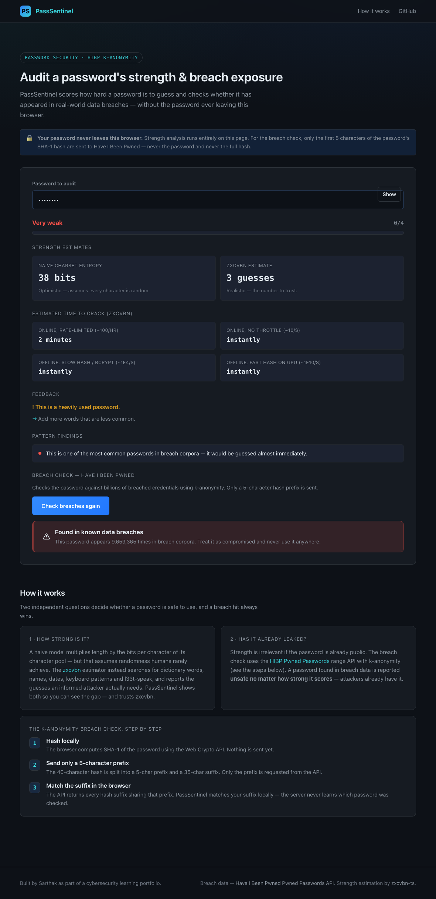

# PassSentinel — Password Strength Auditor

> Score how strong a password is **and** check whether it has leaked in a real-world data breach — without the password ever leaving your machine.


[](https://sarthakagrwal.github.io/password-strength-auditor/)

## Live demo

**https://sarthakagrwal.github.io/password-strength-auditor/**

The website is fully client-side: strength analysis runs in your browser, and the
breach check only ever sends a 5-character hash prefix (see [How it works](#how-it-works)).

## What it does

PassSentinel answers two independent questions about a password: **how hard is it
to guess**, and **has it already appeared in a public breach**. It reports a
naive charset-entropy estimate alongside the realistic [zxcvbn][zxcvbn] estimate,
projects crack times across four attacker scenarios, flags transparent weakness
patterns, and privately checks the password against the
[Have I Been Pwned][hibp] Pwned Passwords corpus using the k-anonymity model.

It ships as both a Python CLI (`pwaudit`) and a website.



_The screenshot is generated automatically by the Playwright test suite and
refreshed on every deploy._

## Features

- **Two strength estimates, honestly compared** — a naive charset-pool entropy
  (`length x log2(pool)`) and the realistic `zxcvbn` score (0–4). The naive
  number is shown so you can *see* how much it overestimates.
- **Crack-time projections** for four attacker models: throttled online,
  unthrottled online, offline slow hash (bcrypt), offline fast hash (GPU).
- **Transparent pattern detectors** — common-password dictionary, sequential
  runs (`abcd`/`1234`), repeats (`aaaa`), keyboard walks (`qwerty`), leetspeak
  (`p@ssw0rd`), and 4-digit years. Every finding comes with a plain-English
  reason; you can read the code and see exactly what each check does.
- **Private breach check** via the HIBP range API and k-anonymity — only the
  first 5 hex characters of the password's SHA-1 hash are ever transmitted.
- **Breach overrides strength** — a password found in breach data is reported
  `UNSAFE` no matter how high it scores (see below).
- **CLI**: hidden `getpass` prompt, `--file` batch mode, `--json` output,
  `--no-hibp` offline mode, and meaningful exit codes.
- **Website**: live strength meter, show/hide toggle, in-browser breach check,
  zero analytics, zero tracking.

## Privacy guarantee

**The password is sensitive and is treated as such. It is never transmitted,
never logged, and never written to disk.**

- The breach check uses **k-anonymity**: the password is hashed locally with
  SHA-1, and only the **first 5 hex characters** of that hash are sent to the
  HIBP API. The password and the full hash never leave your machine.
- The **CLI** reads the password with `getpass` (no terminal echo), keeps it in
  memory only, and writes it nowhere — not to a file, not to logs, not to shell
  history. `--file` *reads* a list you supply; it never *creates* one. A test in
  the suite asserts that no file written during a CLI run contains a password.
- The **website** input is `type="password"`; nothing is sent anywhere except
  the 5-character prefix; there is no analytics or telemetry of any kind.

## How it works

### 1 — Strength: naive entropy vs. zxcvbn

The classic "password strength" formula detects which character classes a
password uses (lowercase 26, uppercase 26, digits 10, symbols ~33), sums them
into a search-space *pool*, and computes `entropy_bits = length x log2(pool)`.
Dividing `2^bits` by documented attacker guess rates gives a crack-time estimate.

**This model is optimistic — it assumes the password is random.** Real passwords
are not. `Password123!` uses all four character classes and 12 characters, so
the naive model rates it at ~78 "bits", yet it is one of the first passwords any
attacker tries. PassSentinel therefore also runs [**zxcvbn**][zxcvbn], which
searches for dictionary words, names, dates, keyboard patterns, repeats and l33t
substitutions and reports the number of guesses an *informed* attacker actually
needs. Both numbers are shown — **the zxcvbn score is the one to trust**, and the
naive number is displayed only to make the gap visible.

### 2 — Breach exposure via k-anonymity

Strength is irrelevant if the password is already public. Checking a password
against a breach corpus naively would mean sending the password (or its hash) to
a server — unacceptable. The [HIBP Pwned Passwords][hibp] *range* API avoids that
entirely:

1. **Hash locally.** Compute `SHA-1(password)` and uppercase the 40-char hex
   digest. Nothing has been sent.
2. **Split.** Take the first **5** characters as a *prefix* and the remaining
   **35** as a *suffix*.
3. **Send only the prefix.** Request `GET /range/{prefix}` with the
   `Add-Padding: true` header. Hundreds of unrelated hashes share any given
   prefix, so the server cannot tell which password was queried.
4. **Match locally.** The API returns every known suffix under that prefix, each
   with a breach count. Padding rows (count `0`) are discarded. If our suffix is
   in the list, its count is how many times the password appears in breaches.

The password and its full hash never leave the machine. Both the CLI
(`pwaudit/hibp.py`) and the website (`web/src/hibp.ts`) assert that the request
URL contains nothing beyond the 5-character prefix.

> SHA-1 is used here only because the HIBP corpus is indexed by SHA-1. It is
> **not** a recommendation for password storage — use bcrypt/argon2 for that.

### Why a breached password is UNSAFE regardless of strength

PassSentinel's overriding rule: **if the breach check finds the password, the
verdict is `UNSAFE` — full stop, no matter how strong it scored.**

A long, high-entropy password that appears in a breach corpus is *not* safe to
use. Once a password is public, attackers already have it: it sits at the top of
every credential-stuffing and password-spraying wordlist, and an attacker will
try it directly long before brute-forcing anything. Entropy measures resistance
to *guessing from scratch* — it says nothing about a password that no longer has
to be guessed at all. So breach presence overrides the strength score entirely.

## Quickstart

### CLI

Requires Python 3.13+.

```bash
# Clone and enter the repo
git clone https://github.com/Sarthakagrwal/password-strength-auditor.git
cd password-strength-auditor

# Create a virtual environment and install
python3 -m venv .venv
./.venv/bin/pip install -e ".[dev]"

# Audit a single password — you are prompted; input is hidden
./.venv/bin/pwaudit

# Audit a list of passwords (table output, non-zero exit if any are weak)
./.venv/bin/pwaudit --file examples/sample-passwords.txt

# Machine-readable output
./.venv/bin/pwaudit --json

# Offline mode — skip the breach check entirely
./.venv/bin/pwaudit --no-hibp
```

Exit codes: `0` = every audited password is safe, `1` = at least one is weak or
breached, `2` = a usage error, `130` = interrupted at the prompt.

### Website

Requires Node.js 24+.

```bash
cd web
npm install
npm run dev        # local dev server
npm run build      # production build into web/dist
npm run preview    # serve the production build at http://localhost:4173
```

## Testing

```bash
# Python — lint and unit tests
ruff check .
./.venv/bin/pytest -q

# Website — unit tests (Vitest)
cd web && npm run test

# Website — end-to-end tests (Playwright); installs the browser on first run
cd web && npx playwright install chromium && npm run test:e2e
```

The Playwright suite intercepts `api.pwnedpasswords.com` with fixed responses so
it is deterministic and offline. One optional `@live` test (excluded from the
default run) exercises the real API — run it by setting `RUN_LIVE=1`:

```bash
cd web && RUN_LIVE=1 npx playwright test --grep @live
```

## Project structure

```
password-strength-auditor/
  pwaudit/                 Python core + CLI
    entropy.py             charset-pool entropy + crack-time projections
    patterns.py            transparent weakness detectors
    strength.py            naive model + zxcvbn, combined
    hibp.py                HIBP k-anonymity client
    audit.py               orchestration + overall verdict
    cli.py                 the `pwaudit` command-line interface
    common_passwords.py    bundled common-password dictionary
  tests/                   pytest suite
  examples/                sample password list for `--file`
  web/                     Vite + TypeScript website (the Pages site)
    src/
      strength.ts          zxcvbn-ts integration + charset model
      hibp.ts              browser k-anonymity client (Web Crypto + fetch)
      patterns.ts          transparent weakness detectors
      crackTime.ts          crack-time formatting
      main.ts              page + UI wiring
    e2e/                   Playwright end-to-end tests
  docs/screenshot.png      README screenshot (auto-generated)
```

## Data sources / credits

- **Breach data** — the [Have I Been Pwned Pwned Passwords API][hibp], created
  and maintained by Troy Hunt. Used via the privacy-preserving range endpoint.
  No API key required; CORS-enabled.
- **Strength estimation** — [zxcvbn][zxcvbn] (Dropbox) on the CLI and
  [zxcvbn-ts][zxcvbn-ts] in the browser.

## License

MIT — see [LICENSE](LICENSE).

---

_This project was built as part of a cybersecurity learning portfolio._

[hibp]: https://haveibeenpwned.com/Passwords
[zxcvbn]: https://github.com/dropbox/zxcvbn
[zxcvbn-ts]: https://github.com/zxcvbn-ts/zxcvbn
